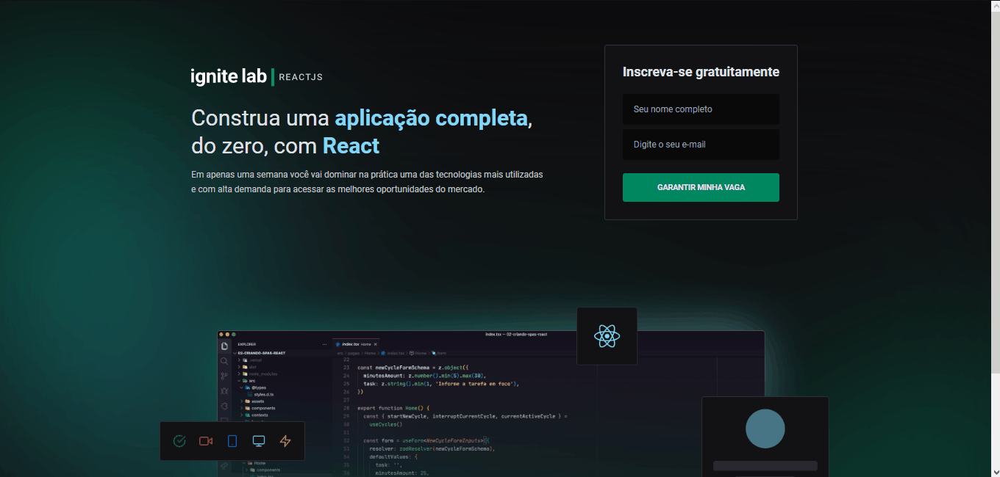

<h1>Event Platform</h1>

Aplicação para disponibilizar agendados utilizando
o GraphCMS 

 

🌐 Publicado na Vercel
<a href="https://ignitelab-event-platform.vercel.app">Faça o teste aqui.</a>

<h2>Tecnlogias</h2>

<li>React Vite Typescript</li>
<li>TailwindCSS</li>
<li>GraphQL</li>
</ul>

 

<h1 align="center">
    
</h1>